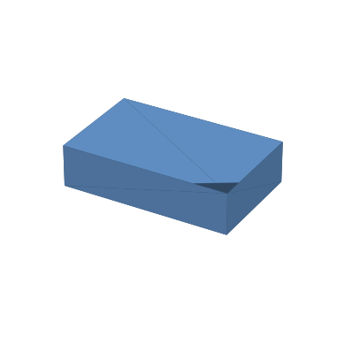
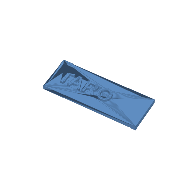
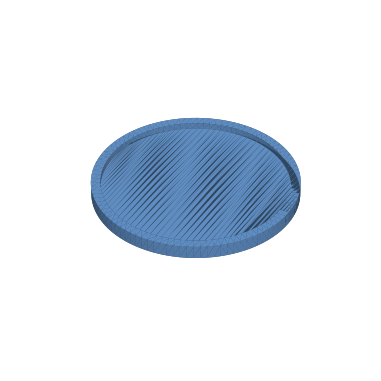
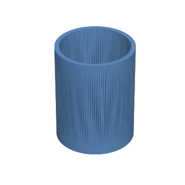
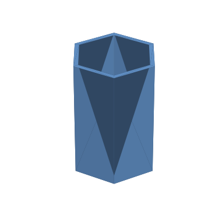
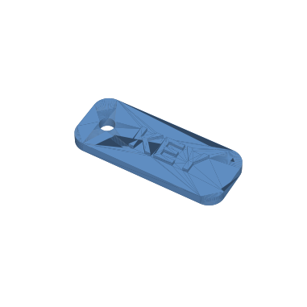
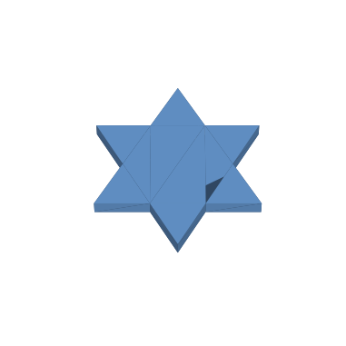

# 03. 段階別の例題集

やさしい順に7つ並べてあります。**すべてブラウザ版OpenSCADで動作確認済み**です。

進め方は2通り。どちらでもOKです。

- **コピペで試す**：下のコードをそのままエディタに貼って、数字を変えて遊ぶ。
- **LLMに頼む**：各例題の「LLMへのお願い例」をLLMに投げて、出てきたコードを貼る。

> 各コードは [examples/](../examples/) フォルダにも `.scad` ファイルとして入っています。

---

## 例題1：はじめての箱 ⭐（ウォームアップ）

立方体を1つ作るだけ。数字を変えると大きさが変わります。



**LLMへのお願い例**
> OpenSCADで、よこ40mm・おくゆき25mm・たかさ10mmの箱を作るコードだけ出力して。

```scad
// たて・よこ・高さを変えて遊んでみよう（単位はmm）
cube([40, 25, 10]);   // [よこ, おくゆき, たかさ]
```

**やってみよう**：数字を `[60, 60, 5]` に変えると、薄い板になります。

---

## 例題2：ネームプレート ⭐⭐

土台に名前を浮き出させます。`"TARO"` を自分の名前（ローマ字）に変えてください。



**LLMへのお願い例**
> OpenSCADで、80×30mmのプレートに「TARO」という文字を浮き出させるコードだけ出力して。文字は太めで。

```scad
plate_w = 80;   // プレートのよこ幅(mm)
plate_d = 30;   // プレートのおくゆき(mm)
plate_h = 4;    // プレートのあつさ(mm)

cube([plate_w, plate_d, plate_h]);                 // 土台プレート

translate([6, 9, plate_h])                         // 文字の位置（左下から）
  linear_extrude(height = 2)                       // 文字のあつみ(mm)
    text("TARO", size = 12, font = "Liberation Sans:style=Bold");
```

**やってみよう**：`size` を大きくすると文字が大きく。長い名前は `size` を小さめに。

> 💡 日本語の名前を入れたい人は [04_troubleshooting](04_troubleshooting.md) の「文字」の項目を見てください。まずはローマ字が安全です。

---

## 例題3：コースター ⭐⭐

丸い土台のふちを残して内側をくぼませます。「引き算」`difference()` の練習。



**LLMへのお願い例**
> OpenSCADで、半径45mmの丸いコースターを作って。ふちを4mm残して内側を3mmくぼませて。コードだけ。

```scad
radius = 45;   // 半径(mm)
height = 6;    // ぜんたいのたかさ(mm)
rim    = 4;    // ふちの太さ(mm)
depth  = 3;    // へこみのふかさ(mm)
$fn = 100;     // 円のなめらかさ（大きいほどなめらか）

difference() {                                      // 引き算
  cylinder(r = radius, h = height);                 // 土台
  translate([0, 0, height - depth])
    cylinder(r = radius - rim, h = depth + 1);      // 内側をくり抜く
}
```

**やってみよう**：`$fn = 6` にすると、丸が六角形のコースターに変わります。

---

## 例題4：ペン立て（コップ型）⭐⭐⭐

外側の筒から内側をくり抜いて「入れ物」に。コップや小物入れの基本形です。



**LLMへのお願い例**
> OpenSCADで、外径70mm・高さ90mm・かべ4mmのペン立て（筒状の入れ物）を作って。コードだけ。

```scad
outer_r = 35;   // 外側の半径(mm)  ※直径70mm
wall    = 4;    // かべのあつさ(mm)
height  = 90;   // たかさ(mm)
bottom  = 5;    // 底のあつさ(mm)
$fn = 120;

difference() {
  cylinder(r = outer_r, h = height);               // 外側
  translate([0, 0, bottom])                        // 底を残して
    cylinder(r = outer_r - wall, h = height);      // 内側をくり抜く
}
```

**やってみよう**：`height` を小さくすると小物入れ、大きくすると傘立て風に。

---

## 例題5：六角形のペン立て ⭐⭐⭐（形を変える練習）

`$fn = 6` を足すだけで、円が六角形になります。「設定をひとつ変えると形が変わる」感覚を掴みます。



**LLMへのお願い例**
> さっきのペン立てを、丸ではなく六角形の筒にして。完全なコードだけ出力して。

```scad
size   = 35;   // 六角形の大きさ(半径mm)
wall   = 4;    // かべのあつさ(mm)
height = 95;   // たかさ(mm)
bottom = 5;    // 底のあつさ(mm)

difference() {
  cylinder(r = size, h = height, $fn = 6);              // 六角柱（外）
  translate([0, 0, bottom])
    cylinder(r = size - wall, h = height, $fn = 6);     // 六角柱（内）をくり抜く
}
```

**やってみよう**：`$fn = 3` で三角、`$fn = 8` で八角。数字＝角の数です。

---

## 例題6：キーホルダー ⭐⭐⭐⭐

角丸プレート＋ひも穴＋文字。`hull()`（包む）で角を丸める少し高度な技。



**LLMへのお願い例**
> OpenSCADで、60×24mmの角丸プレートのキーホルダーを作って。ひもを通す穴と「KEY」の文字を入れて。コードだけ。

```scad
tag_w = 60;   // よこ(mm)
tag_d = 24;   // たて(mm)
tag_h = 4;    // あつさ(mm)
r     = 6;    // 角の丸み(mm)
$fn   = 60;

difference() {
  hull() {                                          // 4すみの円柱を包んで角丸に
    translate([r,       r,       0]) cylinder(r=r, h=tag_h);
    translate([tag_w-r, r,       0]) cylinder(r=r, h=tag_h);
    translate([r,       tag_d-r, 0]) cylinder(r=r, h=tag_h);
    translate([tag_w-r, tag_d-r, 0]) cylinder(r=r, h=tag_h);
  }
  translate([9, tag_d/2, -1]) cylinder(r=3, h=tag_h+2);  // ひも穴
}

translate([20, 7, tag_h])                           // 文字
  linear_extrude(height = 1.5)
    text("KEY", size = 10, font = "Liberation Sans:style=Bold");
```

**やってみよう**：`"KEY"` を好きな英数字に。`r` を大きくすると角がもっと丸く。

---

## 例題7：星のオーナメント ⭐⭐⭐⭐（自由制作のヒント）

三角形を2つ重ねて六芒星に。ひも穴つきなので飾れます。自由制作の発想のたねに。



**LLMへのお願い例**
> OpenSCADで、六芒星（星形）のオーナメントを作って。厚み4mm、ひもを通す穴つき。コードだけ。

```scad
size = 50;   // 星の大きさ(mm)
$fn  = 40;

difference() {
  linear_extrude(height = 4) {                       // あつさ4mm
    union() {
      circle(r = size/2, $fn = 3);                   // 三角形1
      rotate(180) circle(r = size/2, $fn = 3);       // 三角形2（180度回転）
    }
  }
  translate([0, size/2 - 3, -1]) cylinder(r = 2.5, h = 6);  // ひも穴
}
```

**やってみよう**：`$fn = 3` の数字を `4` や `5` にして、星の形を変えてみましょう。

---

## 自由制作のおすすめテーマ

時間が余ったら、LLMに頼んで好きなものを作ってみましょう。比較的うまくいきやすいお題：

- 名札スタンド／卓上ネームプレート
- スマホスタンド
- クッキー型（抜き型）
- 印鑑ケース・小物トレイ
- サイコロ（数字やくぼみ付き）
- 表札・ドアプレート

困ったら [04_troubleshooting.md](04_troubleshooting.md) へ。
